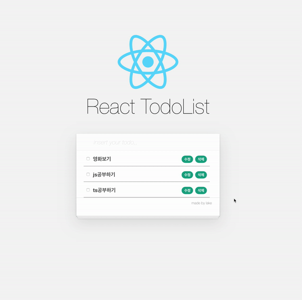

# TodoList_REACT

> React로 Todolist를 구현해보는 repo이다.

## OverView

## Issue 
- [x] Update
- [x] Delete
- [x] state Array
- [x] componentDidUpdate
- [x] show console about state
- [x] CheckBox
- [x] when input text isn't input, not add 
- [x] directory refatoring
